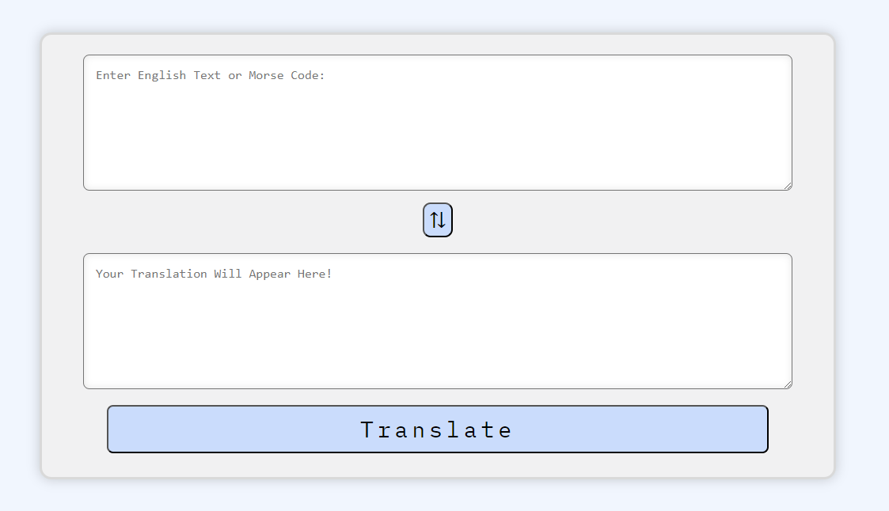

<h1 style="font-weight: 900"> Morse Code to English // English to Morse Code Translator </h1>
https://timbroderick44.github.io/Morse-translator/

This is an app that is able to translate English to Morse Code and vice versa. It has a very simple, streamline appearance that allows for ease of use and accurate translations

<h1 style="font-weight: 900"> Screenshots </h1>

## 1. Simple but gets the job done!

## What did I use to create it?

This project uses:

-   HTML
-   SCSS
-   JS

## Features of the Project:

-  The app provides accurate translations in both English and Morse code. 
-  Any Morse code that is outputted can be played back. 
   -  (The playback can also be stopped and resumed)
-  Translation text and the original input can be switched. 

<h1 style="font-weight: 900"> Here are some of the lessons I learnt:</h1>

## Implements TDD (Test Driven Development).

-  We were challenged to create tests (using JEST) that would assist us during the development of our projects. It was very valuable being reminded of edge cases throughout the development of the project - and therefore I was able to deal with them as they occured. It was difficult to implement at first; I had trouble when any DOM manipulation was involved. However, with practise and further research, I was able to effectively test specific methods within the main object of my project. 

## What I want to include in the future:

## Have more functionality:

-   [ ] Create a better aesthetic 
-   [ ] Allow users to save / bookmark the translation
-   [ ] Include some kind of animation that show the Morse code being played. 
-   [ ] Create a 'Morse code' quiz for users. The user will need to provide the English translation for the Morse code provided. 

## Thank You!

Thank you for taking the time to look at this project. I really hope you enjoy it.
Feel free to reach out and ask any questions.

[Tim Broderick]
